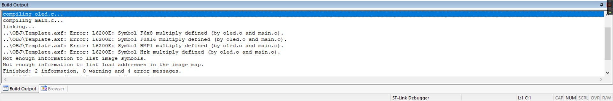

1. 在hal库图形化界面中配置SCL、SDA引脚，均配置为开漏输出 -> 悬浮
2. 导入 OLED.h、OLED.c、OLEDFont.h、OLEDFont.c 文件
3. #include "OLED.h" 、 #include "OLEDFont.h"
4. 在OLED.c中修改引脚定义 GPIO_Port、SCL_GPIO_Pin、SDA_GPIO_Pin
5. 在main.c中调用OLED_Init()初始化OLED
6. 测试代码：
	OLED_ShowChar(1, 1, 'A');
	OLED_ShowString(1, 3, "HelloWorld!");
	OLED_ShowNum(2, 1, 12345, 5);
	OLED_ShowSignedNum(2, 7, -66, 2);
	OLED_ShowHexNum(3, 1, 0xAA55, 4);
	OLED_ShowBinNum(4, 1, 0xAA55, 16);

注意事项：
keil的重复定义问题：Error: L6200E: Symbol F6x8 multiply defined

解决方案：原因是我在头文件里面不是声明，而是直接定义了变量，而对应的C文件没有变量的定义，所以才会出现这种错误
解决方法就是将头文件里面的变量直接移到c文件里面，然后在头文件声明，比如在c文件里面是const unsigned char F6x8[][16],在头文件里面声明就是extern const unsigned char F6x8[][16]，这样就可以了！